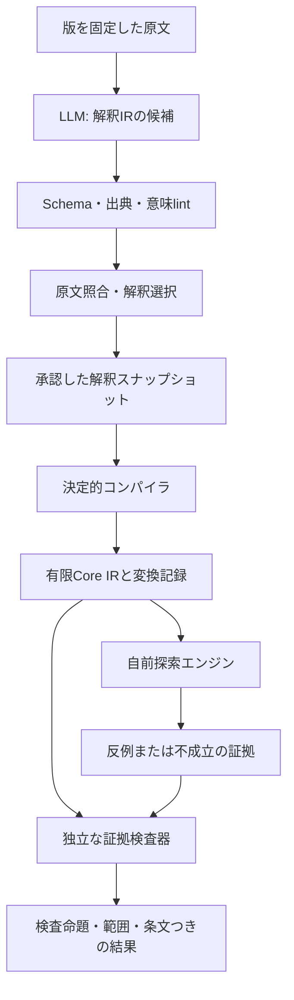

# 自前検証エンジンとLLM形式化基盤の開発計画

作成: 2026-09-14
状態: **全体の計画案 v0.1。2026-09-16までにT01〜T10とT03.1を各限定profileで実装し、有限手続・時間カーネルと刑事訴訟法203条から205条の暫定数値期限packまで到達。JSON Schemaファイル、一般の意味lint、LLM接続、法律専門家レビューは未実装。**

今回の実装範囲は [finite-decisions/1](../docs/kernel-v0.1.md)、[手書き解釈IR v0.1](../docs/interpretation-ir-v0.1.md)、[段階別到達可能性 v0.1](../docs/staged-reachability-v0.1.md)、[有限規範カーネル v0.1](../docs/normative-kernel-v0.1.md)を、確認結果は[基礎検証](../docs/verification-2026-09-15.md)、[T05検証](../docs/verification-t05-2026-09-15.md)、[T03.1検証](../docs/verification-t03.1-2026-09-15.md)、[T06検証](../docs/verification-t06-2026-09-15.md)、[T07検証](../docs/verification-t07-2026-09-16.md)、[T08検証](../docs/verification-t08-2026-09-16.md)を参照する。以下の将来機能を全て実装したわけではない。

## 次に進める計画（2026-09-16）

ユーザーの希望に合わせ、6→20→50→100規則の架空教材から、刑法の最小論点、時間を扱う架空手続、刑事訴訟法の条文群へ進む[段階拡張計画](legal-scale-roadmap.md)を追加した。[作業チケット](legal-scale-tasks.md)のT01〜T10とT03.1は限定profileで完了した。T06は合成workloadの容量測定、T07は刑法41条のPROVISIONALな開発fixture、T08は時間なし規範、T09は有限手続・時間、T10は刑事訴訟法203条から205条のPROVISIONALな標準数値期限packである。次はT11で刑法43条・44条等から一つの狭い論点を選ぶ。[引継ぎ文](sol-handoff.md)を使える。

この文書の全体方針を引き継ぎ、具体的な着手順には段階拡張計画を使う。

## 趣味としての進め方

ユーザーの目標は、現実的な範囲のルールを検証し、穴や不整合に気づく手助けになるものを、趣味として育てること。

最初は架空規約5〜10条ほどの年齢・料金条件で、衝突する具体例や条件の抜けを見つける小さな版を作る。この計画は育てていく道筋として使い、全機能を最初の完成条件にしない。

現在地は[STATUS.md](../STATUS.md)、変更理由と検証結果は[開発日誌](../devlog/README.md)に残す。

## 1. 育てる二つの開発の柱

| 開発の柱 | 担当すること | 主な成果物 |
|---|---|---|
| **A. 自前の形式モデル検証ソフト** | 意味を明示した有限モデルを読み、衝突・履行不能・適用漏れなどを検査し、結果の証拠を別の検査器で確認する | 形式言語仕様、型検査、参照評価器、自前探索器、独立証拠検査器、CLI |
| **B. LLM向け規範と中間表現の基盤** | 原文を解釈可能な構造に写し、不明点を残しながら、確認済み部分をAへ渡す | 形式化規範、二層IR、Schema、意味lint、LLM入出力契約、レビュー・版管理 |

AはLLMなしで実行できる。Bは特定のLLM提供元へ固定しない。共通の型・意味論の版と、原文への対応を定めて接続する。

前回のZ3中心の試作品案から方針を変更する。**本番の推論・探索・検証を自前化する今回の計画を優先**し、以前の資料は調査時点の提案として残す。

## 2. 「完全自前」の範囲

完全自前は、次の境界で計画する。

- 独自実装: 規則の意味論、型・参照検査、IR変換、有限展開、探索、SAT処理、証拠生成、証拠検査、原文対応の管理、形式化の意味lint。
- 利用可能: Rust/Python等の処理系、標準ライブラリ、JSON入出力、暗号学的ハッシュ、UI・通信ライブラリ。判断ロジックを外部へ委譲しない。
- 本番依存から除外: Z3、cvc5、既成SATソルバー、Prolog/s(CASP)、Catala等の推論・検証エンジン。
- 開発時のみ任意利用: 既存ソルバーとの比較、既存論文の例の再現、証明助手による小さな核の検証。結果が一致しただけで、自作実装が証明済みとは扱わない。
- 既存の数学・アルゴリズム・標準は参照する。「自前実装」は、新しい論理体系やSATアルゴリズムを発明したという意味ではない。

依存関係一覧を機械検査し、ネットワークのない環境でもA単体で検証できることを完成条件にする。

## 3. 解消を目指す問題と、保証の境界

「既知の問題点を解消」は、[既知課題と受入条件](known-issues.md)に登録した問題ごとに、対策・反例・検査を実装して合格させることとする。計画作成時はすべて未解消。限定カーネルで対策・テストした部分は[検証記録](../docs/verification-2026-09-15.md)に分けて残す。新しい反例が出たら課題を追加する。

特に次を最初から設計に入れる。

1. 未知の事実を偽にしない。入力の矛盾を上書きしない。
2. 義務・事実・違反・禁止・明示的許可を区別する。
3. 例外・優先関係を原文から勝手に補わない。
4. 入力が矛盾しているため何でも証明できる、という空虚な成功を拒否する。
5. 「ある状況で全義務を守れない」と「一つでも守れる状況がある」を取り違えない。
6. ソルバーの証拠と、IRから論理式への変換の正しさを別々に検査する。
7. 打切り、範囲不足、意味未解決、証拠不正を成功表示しない。
8. LLMの自己採点や往復翻訳の一致を、原文への忠実性の証明にしない。

保証を三つに分ける。

| 層 | 何を確認するか | 初期の保証目標 |
|---|---|---|
| 構造 | 型、ID、参照、出典、文字位置、文法 | 決定的な検査で不正入力を拒否 |
| 形式モデル | 採用した意味論・対象範囲の下で、検査命題が成立するか | 検証可能な証拠に基づく確定結果。有限範囲での健全性・完全性を目標にする |
| 原文との対応 | 解釈が原文の意味を保持しているか | 出典・未解決点・独立事例・人のレビューを記録。一般の自由文について自動の完全保証は宣言しない |

有限範囲での完全性とは、**その範囲内の候補を見落とさず判定できること**。現実世界の全主体・全時点・将来の改正まで含むという意味ではない。計算資源で打ち切った場合は未確定とする。

## 4. 接続する構成

原文に未解決点が残る場合、対象の依存関係を確定できた部分だけを切り出して検査できる。ただし、未解決の例外や参照がその部分を変えうる場合は切り出さない。候補の試行結果と正式結果は区分する。

## 5. v1の意味論の範囲

- 対象: 明示された有限集合、上下限付き整数、単位付き金額、有界の離散時点。
- 条件: 型付きの真偽式、比較、有限量化、純粋な非再帰定義。
- ルール: 入力条件から決定結果または規範を出す。v1の条件は入力と純粋定義のみを参照し、規範出力・決定出力・overrideの有効性は参照しない。
- 例外: 特定の規則を打ち消す、根拠付きの明示辺。循環を拒否する。
- 時間: 有限トレース。法令の施行期間と、義務の期限、観測終了は別。
- 未対応: 無限対象、一般の再帰、無制限の未来、裁量や曖昧語の自動数値化。未対応部分は保持して理由を返す。

詳細な意味・検査式・証拠は[Aの設計](engine.md)、原文からそこへ至る条件は[Bの設計](formalization.md)に定める。

## 6. 実装の進め方

| 段階 | 主に作るもの | 次へ進む条件 |
|---|---|---|
| G0 | 今回採用する機能の意味論、IR、結果コード、正解例 | 採用部分の意味と期待結果を決めて実装へ進む |
| G1 | Bの原文パッケージ、二層IR、Schema、意味lint | 出典欠落・未解決・重複ID・循環を確実に検出 |
| G2 | Aの素朴な有限列挙器と独立checker | 小さなモデルで全件一致、証拠改ざん拒否 |
| G3 | 例外、時間、履行不能、適用漏れなどの検査 | 既知課題に対応する反例・対照例に合格 |
| G4 | BのLLMアダプター、形式化規範、レビュー | 誤形式化を検出または保留。全件保留で合格させない |
| G5 | 自前SATによる高速化と変換検査 | 高速化前後の対応、証拠、変換の各ゲートに合格 |
| G6 | CLI・画面・リプレイ束・評価報告 | 原文から結果を再現でき、保証範囲を表示できる |

BのLLM部分は、手で作ったIRとAの基準器が動いた後に接続する。小規模版はG1〜G3の採用機能から成立させ、G4のLLM連携とG5の高速化を後で追加する。24課題すべての詳細化や高速化を、最初の版の一括完成条件にはしない。

[実装ロードマップ](roadmap.md)に、具体的な作業単位と完了条件を置く。研究開発の不確実性が大きいため、現段階では日付を約束せず、各ゲートの成果で進捗を判断する。

## 7. 読む順番と追加の根拠

1. [A: 自前検証エンジン](engine.md)
2. [B: LLM規範と二層IR](formalization.md)
3. [既知課題と受入条件](known-issues.md)
4. [実装ロードマップ](roadmap.md)

今回追加で確認した資料:

- [LRATの原著](https://arxiv.org/abs/1612.02353): 探索と小さな証拠検査器を分ける参考。自作checkerが自動的に検証済みになるわけではない。
- [JSON Schema 2020-12](https://json-schema.org/draft/2020-12/json-schema-validation): 構造検査の規格。法的意味や外部参照の正しさは別に検査する。
- [CompCertの保証範囲](https://compcert.org/man/manual001.html): 証明対象と信頼する処理・環境を明記する参考。
- [LegalRuleML](https://docs.oasis-open.org/legalruleml/legalruleml-core-spec/v1.0/os/legalruleml-core-spec-v1.0-os.html): 出典・時点・例外・解釈を表す項目の参考。

[先行研究の調査報告](../research/2026-09-14-landscape.md)も参照する。これらの研究が本計画の全体や性能を裏付けているとは主張せず、採用した考え方と独自の設計判断を区別する。
