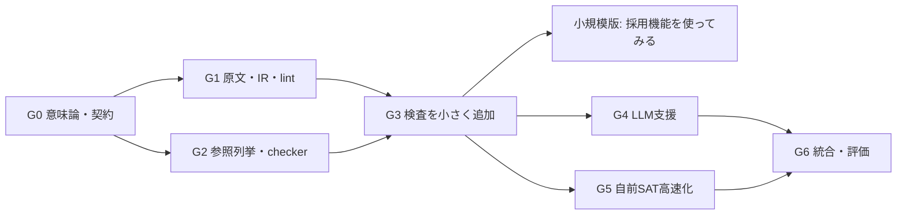

# 実装ロードマップ

状態: 全体の計画案。2026-09-16までにG0/G2/G3/G6の有限決定部分と、G1の原文package・最小手書き解釈IR・Core変換部分を実装した。段階別到達可能性とホスト管理scope期待の照合、T06固定合成ベンチマーク、T07刑法41条の限定的手書き解釈pack、T08有限規範カーネルも実装済み。T07の意味reviewはPROVISIONALで、各ゲート全体は未完了。具体的な[カーネル検証](../docs/verification-2026-09-15.md)、[原文package検証](../docs/verification-t04-2026-09-15.md)、[解釈IR契約](../docs/interpretation-ir-v0.1.md)、[T05検証](../docs/verification-t05-2026-09-15.md)、[T03.1検証](../docs/verification-t03.1-2026-09-15.md)、[T06検証](../docs/verification-t06-2026-09-15.md)、[T07検証](../docs/verification-t07-2026-09-16.md)、[T08仕様](../docs/normative-kernel-v0.1.md)、[T08検証](../docs/verification-t08-2026-09-16.md)を参照する。趣味として小さな版を動かしながら二つの系統を接続していく。

**最初の到達点:** 架空規約5〜10条ほどの年齢・料金条件を、手で作った形式モデルで検査し、衝突や扱いのない条件を具体例で示す。現在地は[STATUS.md](../STATUS.md)、経緯は[開発日誌](../devlog/README.md)を参照する。

具体的な教材規模と実法令への着手順は[段階拡張計画](legal-scale-roadmap.md)で更新した。T01〜T08とT03.1は各限定profileで完了し、次は[作業チケット](legal-scale-tasks.md)のT09。以下は全体の機能設計として残す。

## 1. 開発の順序



G0〜G3も採用する機能単位で進め、小規模版の前に時間・許可・全課題を一括実装しない。G2とG1は共通の型・モデル契約を決めた後に並行して進められる。G4とG5も独立に進められる。高速化の途中でも、参照列挙と独立checkerによる小規模版を使えるようにする。

日程は、各段階の成果と測定値に基づいて見積もる。初回からCDCL、一般SMT、無限時間の規範をまとめて実装する計画にはしない。

## 2. 作成予定の構成

以下は将来の配置案。現在の実装はrulekernel/、tests/、examples/、docs/にあり、[README](../README.md)から実行できる。

```text
spec/
  semantics-v1.md
  core-grammar.md
  queries.md
  proof-format.md
  normalization.md
  assurance-ledger.md
norms/
  formalizer-contract.md
  rules.json
schemas/
  source-document.schema.json
  source-unit-manifest.schema.json
  candidate-interpretation.schema.json
  interpretation.schema.json
  core.schema.json
  task-envelope.schema.json
  candidate-envelope.schema.json
  review-record.schema.json
  verification-result.schema.json
crates/
  core-model/          # 型・入出力用データ。探索は含めない
  core-validate/       # 型・参照・意味lint
  core-lower/          # 有限展開と変換証跡
  core-search/         # 自前DPLL/CDCL等
  core-checker/        # 小さな別実装の証拠検査
  core-cli/
  source-package/
  interpretation/
  formalizer-adapter/
reference/
  evaluator.py        # Python標準ライブラリの素朴評価
fixtures/
  K01/ ... K24/
  cnf-small/
  source-unicode/
  translation-mutations/
benchmarks/
  development/
  tuning/
  heldout/
artifacts/
  verification-bundles/
reports/
  acceptance/
```

checkerは検索・最適化・変換の実装を再利用しない。共通データ型を使う場合も、意味を判断する処理まで共有しない。参照評価器も本体と同じ変換後CNFだけを評価する作りにはしない。

## 3. G0: 意味論・契約・最初の正解を固定する

作業:

- A-001: finite-rules/1の型規則、定義、決定値、規範、overrideの意味を式で書く。
- A-002: 検査命題、量化の順序、背景不整合の分類を固定する。
- A-003: 元Coreの被覆木、SAT割当、CNF証明木の証拠契約を設計する。
- B-001: SourceUnitManifest、二層IR、候補とホスト記録のSchema境界を固定する。
- B-002: ハッシュ対象、文字位置、抽出・正規シリアライズのプロファイルを固定する。
- AB-001: 今回採用する機能に関係する課題から、正常例・反例・期待結果をコードとは独立に書く。24課題の一覧は保持し、未採用機能の詳細fixtureはその実装前に追加する。

必須の決定:

1. 条件は入力と純粋定義だけを参照する。
2. overrideは明示辺だけ、有効な上位規則だけが抑止し、例外の例外で原則が復活する。
3. 一部期間の例外は意味保存を示せる構成だけ受理する。存在量化の義務を全称義務へ変える分割は禁止。
4. 未知と矛盾は区別し、未解決の原文と未知の入力も別にする。
5. 承認・証拠・キャッシュを結び付ける版とハッシュの集合を確定する。

完了条件: 採用する機能について、文書だけを見た独立レビュアーが代表例の結果を同じに計算できる。対応する証明義務を台帳へ登録し、未採用のP01〜P08の項目は将来の課題として保持する。

## 4. G1: 原文・IR・lintを先に実装する

作業:

- B-003: UTF-8固定テキスト、元データ、抽出プロファイル、span resolver。
- B-004: 原文単位マニフェストとcoverageの一対一対応。
- B-005: 候補用Schemaと保存用Schema、重複キー/ID拒否。
- B-006: 型・単位・変数束縛・参照・DAG・未解決依存のlint。
- B-007: 規範F01〜F16のレジストリと、人レビューが必要な区分。
- AB-002: 手で作った解釈IRからCoreを生成する最小コンパイラ。

完了条件: 絵文字、結合文字、CRLF、同文反復、古い版、未解決参照、循環、不正単位のfixtureが期待どおり。候補が承認を自称しても通らない。

成果: LLMなしで、原文と手作業のモデルを正しく結び付けられる。

## 5. G2: 参照列挙器と独立checkerを作る

作業:

- A-004: 型付きCoreを直接評価するPython参照器。
- A-005: 有限領域の列挙、入力整合性、決定結果の収集。
- A-006: 元Core上の完全割当の再評価。
- A-007: 領域被覆木の証拠形式とRust checker。
- A-008: 上限、キャンセル、不正証拠、対象hash違いの拒否。
- AB-003: CLIの結果型と検査束。

完了条件: 小さな全数検査が一致する。証拠の枝・割当・対象モデルを変えた負例を拒否する。LLMや外部solverなしで動く。

手書きの`authored_core`と、Bから変換された`interpreted_source`の両入力経路を確認する。前者に自然文対応確認済みの表示を付けない。

成果: 小規模だが完全自前の検査経路。反例なしの結論は、範囲を覆う証拠の検査に成功した場合だけ返す。

## 6. G3: 規範・時間・検査命題を実装する

作業:

- A-009: override DAGの評価と出典追跡。
- A-010: 決定衝突、到達不能、常に抑止される規則、適用漏れ。
- A-011: 義務・禁止の同時履行、許可の個別行使可能性。
- A-012: 状況ごとの行動列探索、背景だけでも実行不能な状況の分離。
- A-013: 期限、観測不足、実際の違反、改定差分。
- B-008: 有限化・量化展開・意味保存できる分割のprovenance。

完了条件: K01〜K15の対応機能、三者衝突、部分的な時間重複、例外復活の対照例に合格。未対応の部分期間overrideを、意味を変えて通さない。

成果: 「ある状況で何が衝突するか」「行動の選び方で解決できるか」を説明できる参照版。

T08実績: A-011とA-012の時間なし部分を`finite-norms/1`として実装した。8状況×8行動候補のfixture、三者衝突、背景不能、許可の個別行使・非行使、producer非依存checkerを固定した。期限、観測不足、実際の違反、規範overrideと原文からの変換は残る。

## 7. G4: LLMの形式化支援を接続する

作業:

- B-009: TaskEnvelope/CandidateEnvelopeと、提供元に依存しないアダプター。
- B-010: 規範をプロンプトとlintへ反映し、差分修正を実装。
- B-011: 解釈候補、仮定、未解決issue、レビュー状態。
- B-012: 元文/ルール/検査結果を並べる最小画面。
- B-013: 承認スナップショットと変更時のstale伝播。
- AB-004: 人が作ったgold、文書単位の未見評価、修正時間の測定。

完了条件: 固定した重大誤訳は正しく直すか保留する。未見の対応範囲について、事前に固定したコンパイル率・意味正確率・保留率の基準を評価する。すべて保留する方式は合格にしない。

成果: 日本語の原文から候補を作り、人が確認して正式検査へ進める版。

## 8. G5: 自前SATで高速化する

作業:

- A-014: one-hot、ちょうど一つ制約、有限式のCNF変換。
- A-015: 自前DPLL、単位伝播、証明木生成。
- A-016: CNF証明checkerと、元Core→CNFの変換証跡checker。
- A-017: 988個の小CNF集合と全割当の比較、変換の境界検査。
- A-018: 必要性を計測してから、watched literals、RUPつき学習節、CDCLを追加。
- A-019: 任意の開発用差分テストとして既存solverと比較する。製品依存には入れない。

完了条件: 元Coreの意味、参照評価、変換証跡、SAT/UNSAT証拠を別々に確認。最適化後も結果の意味と範囲が変わらない。変換検査に通らない高速経路を正式結果に使わない。

成果: 証拠を持つ自前高速版。性能を得るために検証の経路を省略しない。

## 9. G6: 配布可能な研究版にする

作業:

- AB-005: 入出力、原文版、解釈、意味論、query、証拠を含む再生可能な検査束。
- AB-006: ネットワークなしのA単体実行と、依存関係検査。
- AB-007: 全課題の受入結果、未対応範囲、証明義務の進捗を公開文書化。
- AB-008: 原文と結果の対応、誤解を招かないラベル、保留理由の画面検査。
- AB-009: 国内の公開法令工学の例から限定した一例を、人が再形式化して照合する。

完成条件: ソフトが扱える意味論、原文との対応確認、証拠による検査結果、未対応の範囲が区別され、第三者が同じ入力束から結果を再現できる。

この段階で「すべての法律を完全に形式化できる」などの名称・保証は付けない。

## 10. 評価の軸と規模

| 軸 | 最初の測定 |
|---|---|
| 探索・checker | engine.mdに定めた988 CNF集合＋不正証拠fixture |
| ルール意味論 | K01〜K24の正常例と反例、規則順や名前を変える変換試験 |
| 小さな参照モデル | 入力状況64以下、行動列候補4096以下を初期の教材上限の目安とする |
| 原文対応 | 30文書・約120意味単位・約240照会からgoldを作る |
| 品質 | 型、出典、意味、コンパイル率、保留率、重大誤り、人の修正時間を分離 |
| 性能 | 時間・ピークメモリ・証拠サイズ・checker時間・打切り率 |

上の規模は段階が進んだときのベンチマークの目安であり、最初の動作確認の条件ではない。最初は少数の架空例から始める。言語そのものの上限や性能保証でもない。まず素朴版で測定し、その後に固定した性能目標で高速化を評価する。

乱数試験だけに頼らず、列挙できる小空間、意図的な変異、境界例を組み合わせる。未見評価は文書/テンプレート単位で隔離し、評価を見て基準を下げない。

## 11. v1後の拡張順

| 拡張 | 追加するもの | 再検討が必要な保証 |
|---|---|---|
| 解釈差の比較 | 二つの解釈で結論が違う状況を探索 | 入力範囲と共通語彙、何を同値とするか |
| 修復案と極小原因 | 固定制約での極小性、原文修正後の再評価 | 例外が復活する非単調性 |
| 制御日本語の入力 | 少数の定型文と文法で、構文上の曖昧さを減らす | 自由な法文から定型文へ写す意味対応 |
| 救済・違反後の義務 | 事象と状態遷移、一次違反と救済の両記録 | 時間・優先関係・状態遷移の意味 |
| 再帰的な定義 | 限定した正の再帰や層化した否定 | 固定点、停止性、唯一性、証拠形式 |
| より広い数値・時間 | 自前の制約処理や有限状態の時相検査 | 新しい決定手続、健全性、完全性、範囲表示 |

それぞれ別の意味論profileとして扱い、v1の保証を無条件に引き継がない。無限の一般モデルまで一気に拡張する計画にはしない。

## 12. 着手時の作業環境

2026-09-14の計画時はRust本体とPython参照器を候補とし、Python 3.14.4を確認、rustc/cargoはその起動経路のPATHから起動できなかった。翌15日にPython標準ライブラリだけの限定カーネルを実装済み。現在の構成は[STATUS](../STATUS.md)と[実装仕様](../docs/kernel-v0.1.md)を参照する。Rust化は今後の必要性を測定して判断する。

計画時はG0→G1→G2を想定したが、最初の実装はauthored_coreからG2の限定部分を先に完成させた。以後の順序は[段階拡張計画](legal-scale-roadmap.md)で管理し、原文との対応・LLMの誤形式化・検証エンジンの誤りを分けて進める。
